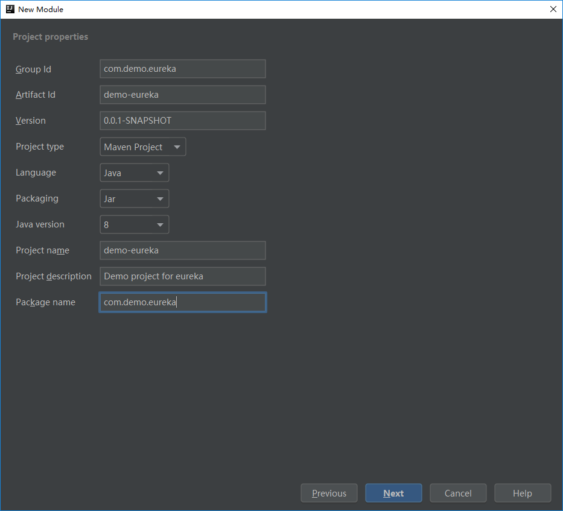
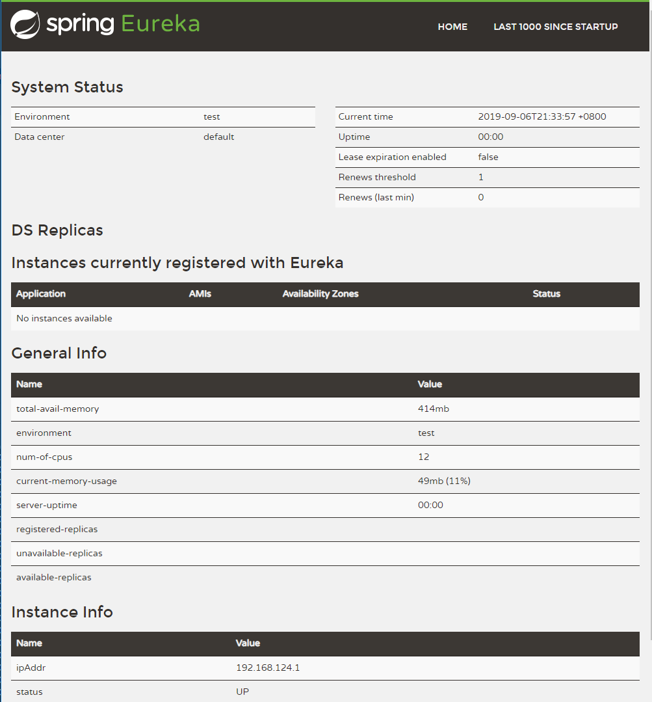
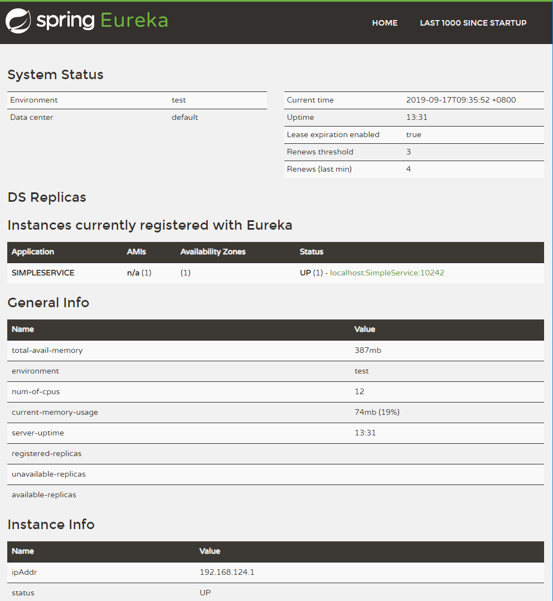
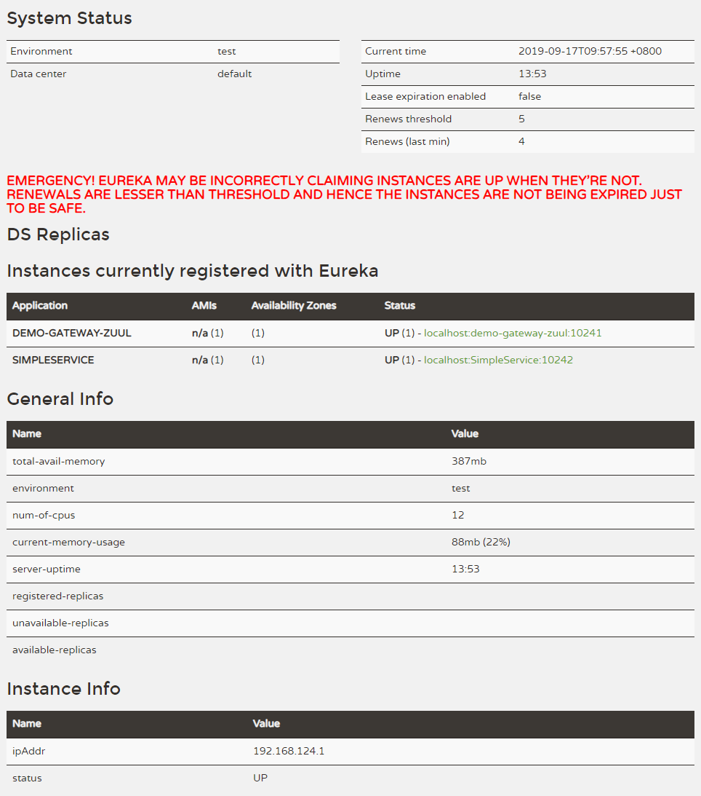

# Spring Cloud 多模块项目 Demo

## 环境、版本
Spring Boot 2.1.8.RELEASE


## 创建一个 Maven 项目
1. New Project - Maven
2. 填写 GroupId 和 ArtifactId
3. 填写 Project name 和 指定项目存储位置
4. 完成

修改：
1. 以后的每个模块都对应一个子目录，这里生成的 src 目录不使用，删除。


## 创建第一个 module : 注册中心 Eureka

1. 在 项目上右键，选择 New - Module 
2. 选择 Spring Initializr （社区版为 Spring Assistant）
3. 填写项目属性（Project properties）：Group Id、 Artifact Id、 Project name、Project description、 Package name 等，如下图：
 
4. Next - 选择组件 Spring CLoud Discovery - Eureka Server
5. Next - 填写 Module name 和指定模块的存储位置
6. **在 Application 前加上 @EnableEurekaServer 注解，开启 Eureka Server 功能**
7. 在 resources 目录下的 application.properties 中添加一些基础的属性，服务名，端口等，如：

	```
	server.port=10240
	spring.application.name=demo-eureka
	
	eureka.instance.hostname=localhost
	# 不向注册中心注册自己
	eureka.client.register-with-eureka=false
	eureka.client.service-url.defaultZone=http://${eureka.instance.hostname}:${server.port}/eureka/
	```

运行效果：
 


## 创建一个简单的 RESTful 服务：SimpleService

作为一个 Eureka Client 以及实际业务模块。

创建的操作步骤参考 Eureka 的创建，对应修改：
 - 选择组件 Web - Spring Web
 - 选择组件 Spring Cloud Discovery - Eureka Discovery Client
 - 编写一个简单的接口，如：

	```
	@RestController
	public class HelloController {
	    @RequestMapping(value = {"/hello"}, method = RequestMethod.GET)
	    public String hello() {
	        return "Hello!";
	    }
	}
	```

 - 在 resources 目录下的 application.properties 中添加一些基础的属性，服务名，端口等，如：

	```
	server.port=10242
	spring.application.name=SimpleService
	eureka.client.service-url.defaultZone=http://127.0.0.1:10240/eureka
	eureka.instance.hostname=simple-service
	```

 - 运行


如图，SimpleService 已经加入 Eureka 注册中心：
	

 - 接口访问测试

	```
	$ curl -s 127.0.0.1:10242/hello
	Hello!
	```


## 创建网关模块：Zuul

创建的操作步骤参考 Eureka 的创建，对应修改：

 - 选择组件 Spring Cloud Routing - Zuul
 - **在 Application 前加上 @EnableZuulProxy 注解**
 - 加入 eureka-client 依赖，让服务注册到注册中心：

	```
			<dependency>
				<groupId>org.springframework.cloud</groupId>
				<artifactId>spring-cloud-starter-netflix-eureka-client</artifactId>
			</dependency>
	```

 - 在 resources 目录下的 application.properties 中添加一些基础的属性，服务名，端口等，如：

	```
	server.port=10241
	spring.application.name=demo-gateway-zuul

	eureka.client.service-url.defaultZone=http://127.0.0.1:10240/eureka
	eureka.instance.hostname=demo-gateway-zuul

	# 所有api接口加上 /v1 作为版本号
	zuul.prefix=/v1

	# routes to url
	zuul.routes.url1.path=/hello/**
	zuul.routes.url1.url=http://localhost:10242/hello/
	```

- 启动工程，会在控制台输出如下打印：

	```
	com.netflix.discovery.DiscoveryClient    : DiscoveryClient_DEMO-GATEWAY-ZUUL/localhost:demo-gateway-zuul:10241 - registration status: 204
	```

在浏览器打开注册中心：http://127.0.0.1:10240/ ，可以看到网关 zuul 已经注册成功。
	

通过网关访问 SimpleService 服务：

	```
	$ curl -s 127.0.0.1:10241/v1/hello
	Hello!
	```